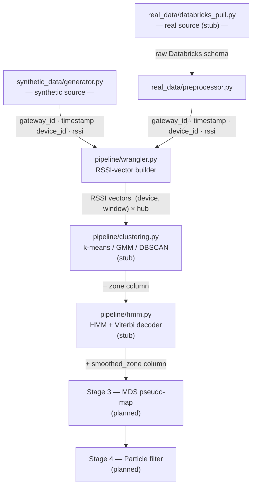

# Bio-Tracker

Unsupervised indoor BLE localization pipeline for Bio Button wearable devices in a hospital setting. Fixed BioHub gateway nodes collect Bluetooth RSSI readings from passively-scanned BioButton devices. The core enabling property is **simultaneous multi-hub visibility**: because multiple hubs hear the same device at the same time, each observation is an RSSI *vector* (one value per hub) rather than a scalar. These vectors carry spatial information without any floor plan or labeled ground truth.

---

## Pipeline Architecture



---

## Directory Tree

```
bio-tracker/
├── config.py               # central pipeline configuration (window size, algorithm params)
├── requirements.txt        # Python dependencies
├── .env                    # Databricks credentials (gitignored — never commit)
│
├── synthetic_data/         # synthetic RSSI dataset generator for offline development
│   ├── config.py           # generator-specific parameters (floor size, hubs, path loss)
│   └── generator.py        # simulates hub-device scanning; outputs long-format DataFrame
│
├── real_data/              # Databricks connectivity and raw data preprocessing
│   ├── databricks_pull.py  # stub: SQL query to pull raw scan telemetry
│   └── preprocessor.py     # cleans raw Databricks rows into the standard pipeline schema
│
├── pipeline/               # core algorithm stages
│   ├── wrangler.py         # Stage 1: pivot long rows → wide RSSI vectors
│   ├── clustering.py       # Stage 2: k-means / GMM / DBSCAN zone discovery (stub)
│   └── hmm.py              # Stage 3: HMM + Viterbi zone-sequence smoother (stub)
│
├── utils/
│   └── helpers.py          # shared utilities: floor_timestamp, rssi_to_distance, load_data
│
├── analysis/               # Jupyter notebooks for EDA and pipeline validation
│   ├── 01_data_overview.ipynb          # real data: gateways, RSSI distribution, clock offsets
│   ├── 02_multi_hub_visibility.ipynb   # bucketing comparison (10 min vs 20 min) + wrangler QA
│   └── 03_synthetic_vs_real.ipynb      # side-by-side calibration comparison (skeleton)
│
├── docs/                   # standalone browser-based BLE coverage sandbox (no Python)
│   ├── index.html
│   ├── styles.css
│   └── js/                 # canvas rendering, path-loss model, zone coloring
│
├── gui/                    # Python GUI layer (placeholder — not yet implemented)
└── outputs/                # generated plots and CSVs (gitignored)
```

---

## Module Status

| Module | File | Status |
|---|---|---|
| Synthetic data generator | `synthetic_data/generator.py` | Implemented |
| Preprocessor | `real_data/preprocessor.py` | Implemented |
| Wrangler | `pipeline/wrangler.py` | Implemented |
| Clustering | `pipeline/clustering.py` | Stub |
| HMM | `pipeline/hmm.py` | Stub |
| Databricks pull | `real_data/databricks_pull.py` | Stub |
| Helpers | `utils/helpers.py` | Student implementation in progress |
| Data overview notebook | `analysis/01_data_overview.ipynb` | Implemented |
| Multi-hub visibility notebook | `analysis/02_multi_hub_visibility.ipynb` | Implemented (requires `floor_timestamp()`) |
| Synthetic vs real notebook | `analysis/03_synthetic_vs_real.ipynb` | Skeleton only |

---

## Setup

**1. Clone the repo**

```bash
git clone <repo-url>
cd bio-tracker
```

**2. Install dependencies**

```bash
pip install -r requirements.txt
```

> **Note — connector mismatch:** `requirements.txt` currently lists `databricks-sdk`, but all notebooks and scripts use `from databricks import sql`, which is provided by `databricks-sql-connector`. Install the correct package:
> ```bash
> pip install databricks-sql-connector
> ```

**3. Create `.env` at the repo root**

Plain `KEY=VALUE` format — **no quotes, no spaces around `=`**:

```
DATABRICKS_SERVER_HOSTNAME=dbc-116b948a-d644.cloud.databricks.com
DATABRICKS_HTTP_PATH=/sql/1.0/warehouses/d89ac2793b1f6d5c
DATABRICKS_TOKEN=your_token_here
```

Required keys:

| Key | Purpose |
|---|---|
| `DATABRICKS_SERVER_HOSTNAME` | Databricks workspace host |
| `DATABRICKS_HTTP_PATH` | SQL warehouse HTTP path |
| `DATABRICKS_TOKEN` | Personal access token |

**4. Notebook credential loading**

Every notebook must call `load_dotenv("../.env")` in its **first code cell**, before any `os.getenv()` call that feeds into `sql.connect()`. Running cells out of order will produce a connection with `None` credentials.

---

## Databricks Connectivity

The pipeline connects via `databricks-sql-connector` (not `databricks-sdk`):

```python
from databricks import sql
import os

connection = sql.connect(
    server_hostname=os.getenv("DATABRICKS_SERVER_HOSTNAME"),
    http_path=os.getenv("DATABRICKS_HTTP_PATH"),
    access_token=os.getenv("DATABRICKS_TOKEN"),
)
```

See `real_data/databricks_pull.py` (stub) and the connection setup cells in each notebook.

---

## Key Data Schemas

**Long format** (raw / preprocessed — one row per hub-device observation):

| Column | Type | Notes |
|---|---|---|
| `gateway_id` | str | BioHub identifier |
| `timestamp` | datetime | UTC-aware after preprocessing |
| `device_id` | str | BioButton identifier |
| `rssi` | float | Signal strength in dBm (always ≤ 0) |

**Wide format** (post-wrangler — one row per device per time window):

MultiIndex `(device_id, time_window)` × hub columns. `NaN` where a hub did not see the device in that window.

---

## Usage

```bash
# Generate synthetic data (saved to outputs/synthetic_data.csv)
python synthetic_data/generator.py

# Verify Databricks connection
python test_connection.py
```

From a notebook or script, import the pipeline directly:

```python
from synthetic_data.generator import generate
from pipeline.wrangler import wrangle

df = generate()           # long-format DataFrame
wide = wrangle(df)        # RSSI vectors, indexed by (device_id, time_window)
```

---

## Critical Gotchas

- **`aggfunc="last"` in `wrangler.py`** means "last by DataFrame row order," not last chronologically. The preprocessor sorts by `(device_id, timestamp)` before the wrangler receives data; this ordering must be verified before trusting deduplication on real data.
- **Use `reported_scan_timestamp`** as the time column in `etl_device_telemetry_bronze.gateway_scan_telemetry`. The `timestamp` column is a pipeline ingestion artifact and is not the scan time.
- **Always exclude `bio_id_test_scan_results`** from queries — it is a test gateway with artificial RSSI readings that will skew any analysis.
- **20-minute bucketing window** is required (not 10 minutes). BioHub nodes have independent fixed clock offsets that span up to ~9.5 minutes across the hub population. A 10-minute window splits hub reports for the same logical scan cycle across two different buckets; 20 minutes contains the full spread in one bucket.
- **`.env` format:** plain `KEY=VALUE`, no quotes, no spaces around `=`. See setup above.
